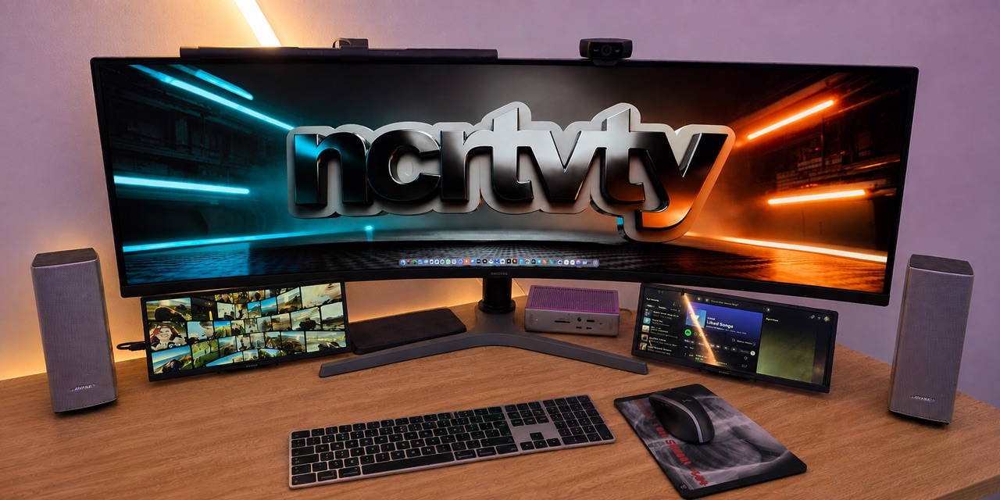

# Xeneon WCH Touchscreen Driver for macOS

An independent open-source macOS user-space touch driver for the [CORSAIR XENEON EDGE](https://www.corsair.com/us/en/p/monitors/cc-9011306-ww/xeneon-edge-14-5-lcd-touchscreen-cc-9011306-ww) and compatible screens that expose the `wch.cn TouchScreen` controller as USB `27C0:0859`. It supports multiple identical touchscreens, safe per-controller display mapping, taps, direct pixel scrolling, hold-to-drag, double-clicking, focus restoration, hotplug recovery, and containment of incoherent controller report storms.

[](https://nocreativity.com/blog/how-openai-codex-turned-a-hardware-problem-into-a-pr)

Input capture, pairing UI, display resolution, event injection, accessibility-based focus restoration, and hotplug observation use documented macOS frameworks directly.

The public project name mentions Xeneon because it is the best-known display using this controller, but retailers sell similarly constructed panels under several names. Compatibility is determined by the controller protocol and configurable display matching.

This project is not affiliated with or endorsed by Corsair, Prechen, or WCH. `OS X` appears in the repository description and topics as a common search term; the current Swift package requires macOS 13 or newer.

## What This Driver Does for You

- Touch the display you intend: taps land at the touched position on that screen, not at the current mouse position or on another display.
- Use multiple identical WCH touchscreens, with each controller paired safely to its physical display.
- Interact naturally with taps, direct scrolling, hold-to-drag, and double-clicking instead of indirect trackpad behavior.
- Keep touch aligned after display rearrangement, reconnects, sleep, and login.
- Stay in control if a faulty controller produces a report storm: malformed input is contained to that controller instead of causing unintended cursor movement or clicks.

The driver pairs each physical controller with the display the user actually touches, follows live display geometry, restores the previously focused Mac window without another synthetic click, and isolates malformed input per controller.

## Known Compatibility

Last updated: **September 2, 2026**. This table distinguishes physically verified hardware from the original reference target and unverified controller matches.

| Display or retail name | Known details | Compatibility evidence |
| --- | --- | --- |
| [Prechen HD-123 12.3-inch Portable Touch Screen Secondary Monitor](https://www.amazon.de/-/en/dp/B0CTMNPBX3), Amazon ASIN `B0CTMNPBX3` | 1920x720 IPS stretched-bar display sold for AIDA64 CPU/GPU/RAM monitoring; USB-C and HDMI; reports `wch.cn TouchScreen` USB `27C0:0859` | Physically verified on September 2, 2026 with two identical panels connected to one Mac. Pairing, tapping, scrolling, hold-drag, double-clicking, reconnect handling, and per-controller storm containment were exercised. |
| [CORSAIR XENEON EDGE 14.5-inch LCD Touchscreen](https://www.corsair.com/us/en/p/monitors/cc-9011306-ww/xeneon-edge-14-5-lcd-touchscreen-cc-9011306-ww) | 2560x720 display; `wch.cn TouchScreen` USB `27C0:0859` | Original reference display and supported controller/display target inherited from the upstream project. This fork's expanded two-panel behavior was physically verified on the Prechen hardware above. |
| Other displays reporting `wch.cn TouchScreen` USB `27C0:0859` | Often marketed as portable touchscreens, secondary monitors, stretched-bar displays, sensor panels, or AIDA64 monitors | Compatibility candidate. A matching controller ID is a strong signal, but display descriptors, report formats, and firmware can still differ. Please report successful or unsuccessful results. |

## Report Another Compatible Display

If your display uses this controller, [open a compatibility report](https://github.com/mrnocreativity/xeneon-wch-touchscreen-driver-macos/issues/new?template=compatibility-report.yml). Reports of both working and non-working models help define the real compatibility boundary. Exact brand names and retail listing titles also help other owners find this project when the same hardware is sold under another name.

Please include:

- brand and exact product or listing name;
- model number, store link, and ASIN or equivalent store identifier;
- USB manufacturer/product strings and VID:PID;
- native display resolution;
- Mac model and macOS version;
- whether the display uses HDMI, direct USB-C, a hub, or a dock;
- results for pairing, tapping, scrolling, hold-drag, and double-clicking.

Do not post the controller's serial number or location ID. Once a report has enough evidence, its marketed product name and result can be added to the dated table so community-confirmed compatibility becomes easier to discover over time.

If the driver works for your setup, please star the repository and submit a compatibility report. Both signals help owners of the same rebranded hardware find a tested result instead of starting the investigation again.

## Install with an AI Coding Agent

The easiest installation path is to give this repository to a local coding
agent such as Codex, Claude Code, Cursor, or another AI tool with filesystem and
terminal access. Ask it to follow the repository's [AI installation
runbook](llm.txt). The runbook gives the agent the exact installation,
permission, physical pairing, verification, troubleshooting, and uninstall
contract.

Copy and send this prompt to the agent:

> Open this repository and follow `llm.txt` as the authoritative installation
> runbook. Install and verify the driver on this Mac. Run the documented
> read-only checks and installer, then explain and wait for any macOS privacy
> approvals or physical **Touch and release the circle** steps that I must perform. Do not
> use sudo, discard existing configuration or pairings, expose hardware
> identifiers, change unrelated files, commit, push, or alter a pull request.

The AI agent cannot grant Input Monitoring or Accessibility permission and
cannot perform the physical pairing touch for you. It should pause, tell you
exactly what is needed, and continue verification after you confirm each step.
A browser-only chatbot without access to this Mac can explain the process but
cannot perform the installation.

## Manual Installation

To install for the current user, just run the following from the root of the checked out repository on the relevant mac:

```sh
./Scripts/install.sh
```

This builds the release binary, installs it under:

```text
~/Library/Application Support/MacXeneonEdgeTouchDriver/bin/MacXeneonEdgeTouchDriver
```

and installs the LaunchAgent at:

```text
~/Library/LaunchAgents/com.ajvwhite.MacXeneonEdgeTouchDriver.plist
```

The generated filename and LaunchAgent label intentionally retain the original
`com.ajvwhite.MacXeneonEdgeTouchDriver` installation identity. This is the
stable internal identifier inherited from the original project—not an
unexpected dependency, network service, or separate third-party application.
Keeping it means existing installations, privacy permissions, configuration,
logs, and saved pairings continue to work after the public repository rename.
Changing it to a fork-specific identifier such as `com.nocreativity` would
create a second installation identity, could leave duplicate LaunchAgents, and
could make macOS request privacy approval again.

No script uses `sudo`. Driver logs are written to:

```text
~/Library/Logs/MacXeneonEdgeTouchDriver/driver.log
```

The LaunchAgent also creates `stdout.log` and `stderr.log` in the same directory for process-level output. The driver itself uses Unified Logging plus `driver.log`, so stdout and stderr are normally empty unless launchd or a lower-level runtime writes there.

For a development machine that rebuilds the driver, pass a stable signing identity so macOS can keep Accessibility and Input Monitoring approval across upgrades:

```sh
CODESIGN_IDENTITY="Developer ID Application: Your Name (TEAMID)" ./Scripts/install.sh
```

Without `CODESIGN_IDENTITY`, Swift's linker ad hoc signature is used. Its designated requirement changes whenever the executable changes, so macOS may require privacy approval again after an upgrade. The signing identity is supplied only through the environment and is never written into the repository, configuration, LaunchAgent, or pairing file.

The installer creates a default config file if one does not already exist:

```text
~/Library/Application Support/MacXeneonEdgeTouchDriver/config.json
```

Uninstall:

```sh
./Scripts/uninstall.sh
```

Uninstall removes the LaunchAgent and Application Support files but keeps logs.

Build a signed release binary:

```sh
./Scripts/build-release.sh
```

By default this uses ad-hoc signing. Set `CODESIGN_IDENTITY` for Developer ID signing and `NOTARIZATION_PROFILE` to submit the release archive with `xcrun notarytool`.

## Configuration

Optional config file:

```text
~/Library/Application Support/MacXeneonEdgeTouchDriver/config.json
```

All fields are optional. Missing or malformed config falls back to defaults and logs a warning.
`logLevel` only controls the minimum level written to `driver.log`; Unified Logging remains controlled by macOS logging configuration.

```json
{
  "logLevel": "info",
  "timing": {
    "warpToClickDelayMs": 10,
    "downToUpDelayMs": 20,
    "clickToWarpBackDelayMs": 10,
    "tapDebounceMs": 50,
    "stuckGestureTimeoutMs": 2000
  },
  "display": {
    "vendorNumber": 3672,
    "modelNumber": 60672,
    "serialNumber": null,
    "expectedWidth": 2560,
    "expectedHeight": 720
  },
  "gesture": {
    "multiTouchEnabled": false,
    "holdToDragMs": 300,
    "movementThresholdPoints": 8,
    "scrollSensitivity": 1.0,
    "doubleClickDistancePoints": 12
  },
  "diagnostics": {
    "fileLogPath": "/Users/ajvwhite/Library/Logs/MacXeneonEdgeTouchDriver/driver.log",
    "fileLogMaxBytes": 5242880
  }
}
```

`gesture.multiTouchEnabled` is always forced to `false` as the hardware only exposes single touch information, if this ever changes we will look to see how to support multi-touch gestures.

## Pairing Multiple Displays

When a controller has no verified assignment, the driver covers one compatible display with **Touch and release the circle**. Touch and release the central circle once, then repeat when the prompt moves to the next display. The physical contact must begin after the target appears, stay near it, and complete within two seconds. Calibration does not generate mouse clicks. Verified associations are saved atomically in:

```text
~/Library/Application Support/MacXeneonEdgeTouchDriver/pairings.json
```

Ambiguous associations are trusted only during uninterrupted observation by the current driver process. Identical controllers with duplicate serials and displays with a zero EDID serial—such as the tested Prechen panels—require physical pairing after a driver restart, sleep/wake, reconnect, or observation gap. Associations can restore across those boundaries only when both endpoints expose public hardware identities that remain unique. Upgrading from an older pairing schema or calibration revision requires the current physical flow once, including for hardware-scoped records.

Display position is never used as identity. CoreGraphics and AppKit notifications suspend routing and cancel queued gesture work before reconciliation. Bounds-only rearrangement and resolution changes preserve verified associations during uninterrupted observation and update their coordinate mapping. Endpoint membership changes revoke ambiguous associations together. During reconnect, the driver re-enumerates incomplete controller/display sets and requires the complete one-to-one topology to remain unchanged across consecutive observations before calibration begins.

The overlay is shown only after fresh CoreGraphics identity and bounds agree with the explicit main and target `NSScreen` records. Each calibration contact rechecks visible placement and the full observed topology. Wrong-target or competing contacts, incoherent input, topology changes, and an unreleased contact restart the attempt. An untouched target stays in place indefinitely; only an in-progress contact has a two-second release deadline. A storming controller cannot authorize pairing.

Touch traffic never starts calibration or advances topology-stability observations. If an unresolved controller enters storm mode, the prompt closes once and pairing waits for all unresolved controllers to recover through the normal quiet-period check. Recovered samples within an ongoing storm cannot pair a display or reopen the prompt. Display rearrangement preserves storm evidence; an already-paired controller's storm does not restart another controller's calibration. The existing confidence-tracking policy for ordinary input on paired controllers is unchanged.

The driver checks live HID/display inventories and AppKit responsiveness once per second. A heartbeat older than four seconds blocks routing immediately and revokes ambiguous authority during recovery. No software can detect a physically indistinguishable endpoint swap that produces no observable notification or inventory change; `re-pair` provides explicit recovery when the physical association is wrong despite apparently unchanged state.

### Driver-owned status and recovery

Run these commands against the installed driver; they do not start a second HID owner:

```sh
"$HOME/Library/Application Support/MacXeneonEdgeTouchDriver/bin/MacXeneonEdgeTouchDriver" status
"$HOME/Library/Application Support/MacXeneonEdgeTouchDriver/bin/MacXeneonEdgeTouchDriver" re-pair
"$HOME/Library/Application Support/MacXeneonEdgeTouchDriver/bin/MacXeneonEdgeTouchDriver" cancel-pairing
```

`status` returns JSON with each controller's state and reason, active display bounds, observation generation, heartbeat freshness, and calibration target. Input diagnostics include received-report, parsed-event, and validated-event counts, the latest event and report age, storm state, and input disposition. They distinguish missing reports from validation or calibration rejection. States are `waitingForHardware`, `needsPairing`, `calibrating`, `active`, and `suspended`; only `active` can route input. Status includes local identifiers and touch coordinates, so redact it before sharing publicly.

`re-pair` revokes all assignments and starts the canonical physical flow once topology is ready. `cancel-pairing` hides calibration and keeps unresolved input disabled; already-verified screens continue working. Use `re-pair` to resume. Commands use a user-private local socket and acknowledge within a bounded timeout; an unreachable driver reports an error rather than editing its files.

Gesture behavior:

- Tap and release: click.
- Tap twice nearby within the macOS double-click interval: double-click.
- Move immediately: pixel-precise scroll.
- Hold still for `holdToDragMs`, then move: mouse drag.

Each controller also has an independent touch-stream validator. It briefly holds an unconfirmed contact and accepts stable taps plus spatially continuous swipes, while rejecting coordinate jumps and incoherent report bursts that cannot represent plausible finger motion. A confirmed storm switches only that controller into confidence-tracking mode: coherent finger paths can continue through interleaved bad coordinates while individual outliers and false transitions are discarded. The other attached touchscreens continue working normally.

Storm recovery is event-driven. One low-frequency GCD timer exists only while a controller is storming and checks the timestamp of the complete raw report stream once per second. After one full second without a report, it logs the incident summary, cancels itself, and restores normal low-latency validation. Active incidents log bounded five-second summaries rather than every raw report.

This protection was added after a panel controller was captured emitting a raw HID touch storm while the production driver was stopped. The reports contained genuine touch bits but rapidly changing coordinates at the controller's report rate, so they originated upstream of synthetic event generation and could not be distinguished by checking the button byte alone. See [Touch Storm Protection Design](docs/plans/2026-09-01-touch-storm-protection-design.md) for the captured evidence and [Active Storm Confidence Tracking Design](docs/plans/2026-09-02-active-storm-confidence-tracking-design.md) for live recovery behavior.

The driver keeps focus on the touched application while a second tap remains possible. After a single- or double-click sequence, it restores the previously focused application and exact window through AppKit and Accessibility—without generating another mouse click on the original display.

Matching devices and compatible displays are discovered at runtime. The pairing overlay creates the one-to-one assignments for the attached hardware and live display arrangement.

## Acknowledgements and Provenance

This implementation was informed by the public macOS touchscreen work and hardware research in:

- [ymlaine/TouchscreenDriver](https://github.com/ymlaine/TouchscreenDriver) for its documentation of the Xeneon Edge controller, raw coordinate ranges, and exclusive user-space HID capture.
- [Myseri/xeneon-edge-multitouch-macos](https://github.com/Myseri/xeneon-edge-multitouch-macos) for its hardware-verified USB/HID investigation and evidence explaining the controller's single-touch behavior on macOS.
- [talesmousinho/m14t-touch-macos](https://github.com/talesmousinho/m14t-touch-macos) as a reference for keeping HID input, display resolution, coordinate mapping, and synthetic events behind small native Swift boundaries.

See [THIRD_PARTY_NOTICES.md](THIRD_PARTY_NOTICES.md) for authorship, license links, and the specific role of each reference.

## Known Caveats

- If the physical mouse is moved during a touch gesture, the cursor will return to the position captured when the touch began.
- Multi-contact gestures are not supported as the hardware doesn't report this information back.
- If the process is killed with `SIGKILL`, normal shutdown cleanup cannot run. Relaunching the driver or moving the physical mouse after cursor association is restored may be needed.

## Troubleshooting

- If the driver exits immediately, check Accessibility permission for the exact binary location as provided by the install script.
- If privacy approval disappears after rebuilding, reinstall with the same `CODESIGN_IDENTITY` each time, then approve that signed binary once.
- If HID open fails, check Input Monitoring permission and confirm no other process has seized the same VID/PID device.
- If a panel model is not detected, run `swift run DisplayInfo` and adjust the optional display config override.
- On identical panels without unique public serials, calibration after a restart, sleep/wake, reconnect, or observation gap is intentional. The driver will not guess from screen order or position.
- If touch reaches the wrong panel, use the installed driver's `re-pair` command above, then touch and release the target once on each prompted screen. Do not manually edit or delete saved mappings.
- For HID investigation, use `swift run HIDDump`; it intentionally runs in non-seize mode and is separate from the production daemon.
